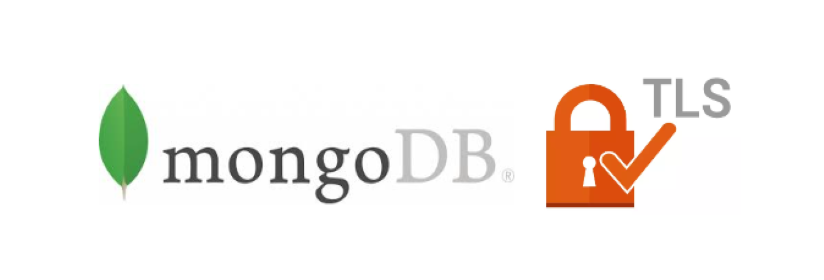

# MongoDB Deployments in localhost with TLS



Demonstration of deploying a MongoDB server with TLS authentication enabled on a single node.

Reqiure:
- MongoDB Server 5.0+
- mkcert

## Quick Start

```shell
bash run.sh
```

## ReplicaSet (PSS)

```shell
# Self-Managed Replica Set
bash run.sh ReplicaSet
```

Topology: [https://www.mongodb.com/docs/manual/images/replica-set-read-write-operations-primary.bakedsvg.svg](https://www.mongodb.com/docs/manual/images/replica-set-read-write-operations-primary.bakedsvg.svg)


## MongoDB Sharding Cluster

```shell
bash run.sh ShardingCluster
```

Topology:


